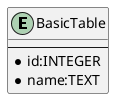
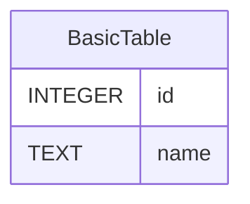

# md2sql

MarkdownのリストからSQL/ERDを生成します。

```bash
$ go install github.com/shibukawa/md2sql...
```

## サンプル

### シンプルなサンプル

* 全てのテーブルは"table: "プリフィックスを持つリストで表現します。
* カラムは"名前: 型"の形式で定義します。

```md
* table: BasicTable
  * id: integer
  * name: string
```

```bash
$ md2sql -f sql simple.md
```

次のようなSQLが得られます。

```sql
CREATE TABLE BasicTable(
    id INTEGER NOT NULL,
    name TEXT NOT NULL
);
```

`-f plantuml`もしくは`-f mermaid`オプションをつけることで、PlantUMLおよびMermaid.js形式のERDが生成できます。





### 基本的なサンプル

主キー、インデックス、外部キーも設定できます。

* 名前に`##`プリフィックスを付けるとプライマリーキーになります。型を省略するとオートインクリメントのフィールドになります。
* 名前に`#`プリフィックスを付けるとインデックスを付与します。
* 型に`*`プリフィックスを付けると外部キーになります。

```md
* table: User
    * ##id
    * name: string
    * #email: string
    * age: integer
    * job: *Job.id

* table: Job
    * ##id
    * name: string
```

次のようなSQLが得られます。

```sql
CREATE TABLE User(
    id SERIAL,
    name TEXT NOT NULL,
    email TEXT NOT NULL,
    age INTEGER NOT NULL,
    job INTEGER NOT NULL,
    PRIMARY KEY(id),
    FOREIGN KEY(job) REFERENCES Job(id)
);

CREATE UNIQUE INDEX INDEX_User_email ON User(email);

CREATE TABLE Job(
    id SERIAL,
    name TEXT NOT NULL,
    PRIMARY KEY(id)
);
```

### 連想エンティティ

`[]`サフィックスをつけることで[連想エンティティ](https://ja.wikipedia.org/wiki/%E9%80%A3%E6%83%B3%E3%82%A8%E3%83%B3%E3%83%86%E3%82%A3%E3%83%86%E3%82%A3)の指定ができます。

```
* table: User
    * ##id
    * name: string
    * age: integer
    * jobs: *Job.id[]

* table: Job
    * ##id
    * name: string
```

次のようなSQLが得られます。

```sql
CREATE TABLE User(
    id SERIAL,
    name TEXT NOT NULL,
    age INTEGER NOT NULL,
    PRIMARY KEY(id)
);

CREATE TABLE Job(
    id SERIAL,
    name TEXT NOT NULL,
    PRIMARY KEY(id)
);

CREATE TABLE User_jobs(
    id SERIAL PRIMARY KEY,
    User_id INTEGER,
    Job_id INTEGER,
    FOREIGN KEY(User_id) REFERENCES User(id),
    FOREIGN KEY(Job_id) REFERENCES Job(id)
);
```

### ステレオタイプ

PlantUMLコード生成ではテーブルのステレオタイプが表現できます。7種類のステレオタイプがあります。

| ラベル                    | 意味                                   | マーク |
| ------------------------- | -------------------------------------- | ------ |
| `table:`                  | 汎用テーブル                           | **E**  |
| `master:`                 | システムを表すテーブル                 | **M**  |
| `tran:` or `transaction:` | アクティビティを表すテーブル           | **T**  |
| `summary:`                | クエリーのキャッシュを保持するテーブル | **E**  |
| `work:`                   | 一時テーブル                           | **W**  |
| `view:`                   | ビュー                                 | **V**  |
| `associativeentity:`      | 連想エンティティ                       | **A**  |


`-`(マイナス) か `_`(アンダースコア)を先頭につけると、従属テーブルを表します。

```md
* master: Users
    * @id
    * name: string
    * age: integer
    * jobs: *Job.id[]

* -tran: Tests
    * @user: Users.id
    * @date: Date
    * score: integer
```

## ライセンス

AGPL