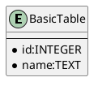
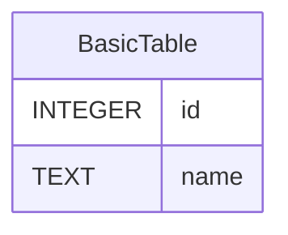

# md2sql

Generate SQL/ERD from Markdown list.

```bash
$ go install github.com/shibukawa/md2sql...
```

## Example

### Simple Example

* All table should start "table: " prefix.
* Each column is formatted in "name: type".

```md
* table: BasicTable
  * id: integer
  * name: string
```

```bash
$ md2sql -f sql simple.md
```

You can get the following SQL:

```sql
CREATE TABLE BasicTable(
    id INTEGER NOT NULL,
    name TEXT NOT NULL
);
```

Also you can get the PlantUML and Mermaid.js ERD by using `-f plantuml` or `-f mermaid`:





### Basic Example

You can specify primary key, index and foreign key.

* `@` prefix of name means primary key. If you omit type, it becomes auto incremental field.
* `$` prefix of name means index.
* `*` prefix of type field means foreign key.

```md
* table: User
    * @id
    * name: string
    * $email: string
    * age: integer
    * job: *Job.id

* table: Job
    * @id
    * name: string
```

You can get the following SQL:

```sql
CREATE TABLE User(
    id SERIAL,
    name TEXT NOT NULL,
    email TEXT NOT NULL,
    age INTEGER NOT NULL,
    job INTEGER NOT NULL,
    PRIMARY KEY(id),
    FOREIGN KEY(job) REFERENCES Job(id)
);

CREATE UNIQUE INDEX INDEX_User_email ON User(email);

CREATE TABLE Job(
    id SERIAL,
    name TEXT NOT NULL,
    PRIMARY KEY(id)
);
```

### Associative Entity

You can specify [Associative Entity](https://en.wikipedia.org/wiki/Associative_entity) by using `[]` suffix.

```
* table: User
    * @id
    * name: string
    * age: integer
    * jobs: *Job.id[]

* table: Job
    * @id
    * name: string
```

You can get the following SQL:

```sql
CREATE TABLE User(
    id SERIAL,
    name TEXT NOT NULL,
    age INTEGER NOT NULL,
    PRIMARY KEY(id)
);

CREATE TABLE Job(
    id SERIAL,
    name TEXT NOT NULL,
    PRIMARY KEY(id)
);

CREATE TABLE User_jobs(
    id SERIAL PRIMARY KEY,
    User_id INTEGER,
    Job_id INTEGER,
    FOREIGN KEY(User_id) REFERENCES User(id),
    FOREIGN KEY(Job_id) REFERENCES Job(id)
);
```

### Stereotype

PlantUML generator can represent stereotypes of tables. There are 7 types you can use:

label   meaning Mark
`table:`   Generic table. **E**
`master:`   Its represents system. **M**
`tran:` or `transaction:` It represents activity.   **T**
`summary:`   It keeps cache of query result.  **E**
`work:`   Temporary table **W**
`view:`   View **V**
`associativeentity:` Associative Entity

And tables that has `-`(minus) or `_`(underscore) prefixed means dependent tables.

```md
* master: Users
    * @id
    * name: string
    * age: integer
    * jobs: *Job.id[]

* -tran: Tests
    * @user: Users.id
    * @date: Date
    * score: integer
```


## License

AGPL